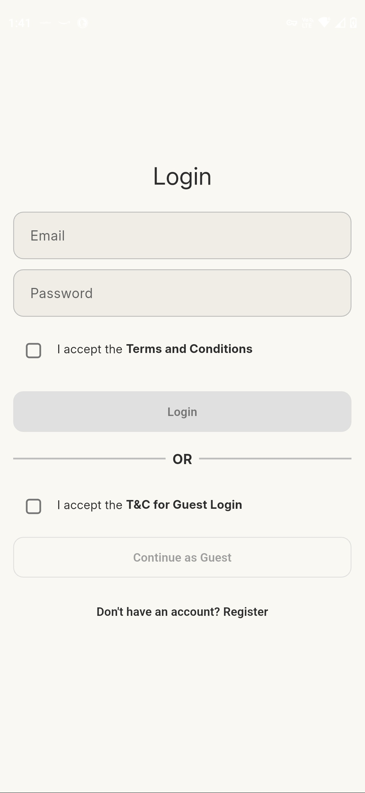
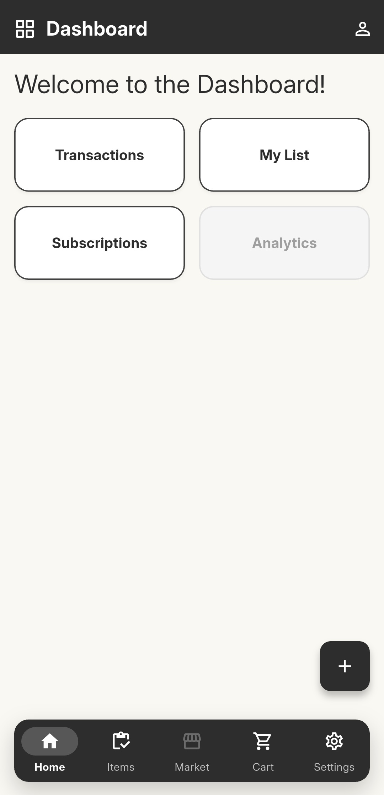
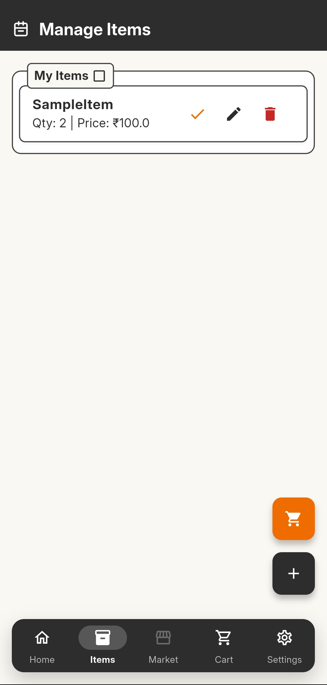
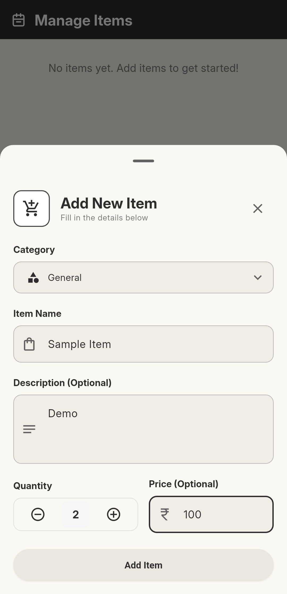
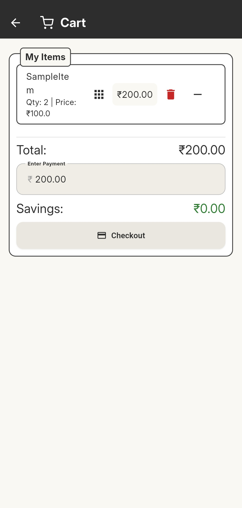
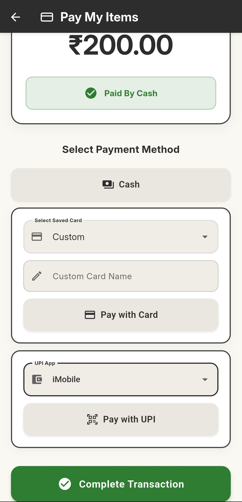
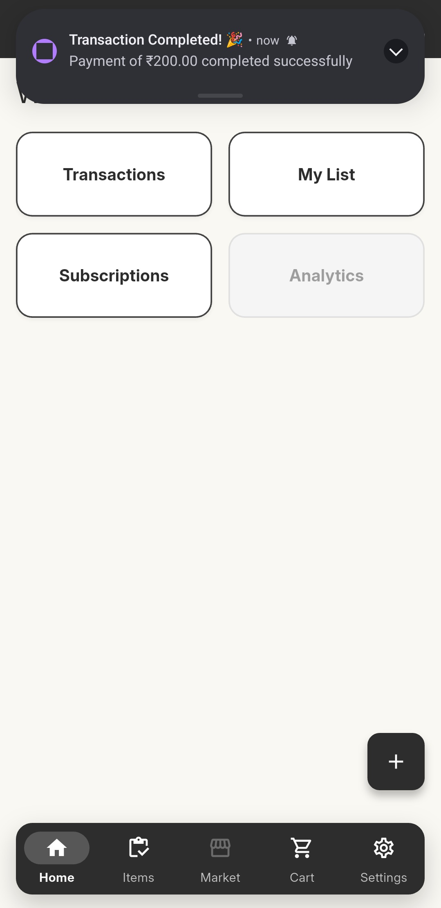
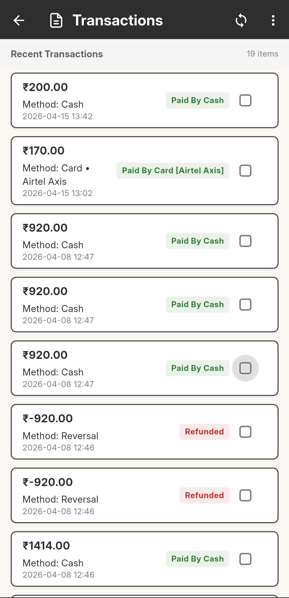
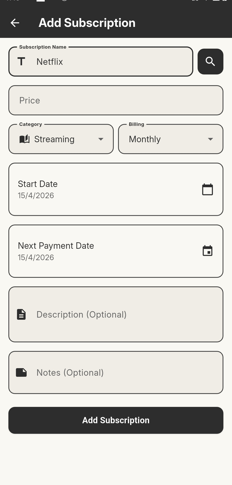
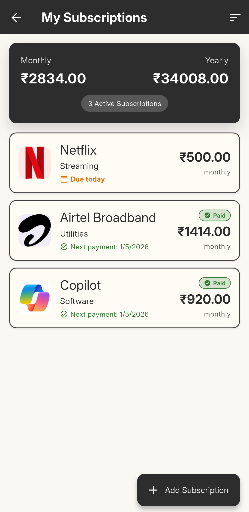

# ✨ Riches List

  

<h1 align="center">Smart Expense Management, Simplified</h1>

  A modern Flutter app for tracking expenses, managing transactions, shopping with ease, and making seamless digital payments.

  
  
  

---

## 🌍 Overview

Riches List is designed to make personal finance more practical, more visual, and less stressful.

From everyday purchases to complete transaction history, the app gives users a simple way to understand spending patterns, manage carts, review payments, and stay organized in one smooth experience. It combines expense tracking with digital convenience so users can make smarter financial decisions every day.

---

## 🚀 What the App Delivers

- 🔐 Secure login and user access
- 📊 A dashboard with quick financial visibility
- 🛍️ Simple item browsing and product management
- 🛒 Smooth cart and checkout experience
- 💳 UPI and NFC powered payment support
- 🧾 Clear transaction records and history
- 🎨 A clean, mobile-first Flutter interface

---

## 📱 Screenshots

  <b>App Preview</b> 
  Grouped screens presented in a clean product showcase format.

### 🔐 Access and Overview

| Login | Dashboard |
|---|---|
|  |  |

### 🛍️ Shopping Flow

| Items | Quick Add Item | Cart |
|---|---|---|
|  |  |  |

### 💳 Payments and Records

| Payment | Transaction | Transactions |
|---|---|---|
|  |  |  |

### 🔔 Subscription Screens

| Subscribe | Subscriptions |
|---|---|
|  |  |

---

## 💡 Why It Matters

Expense management is not just about tracking numbers. It is about building awareness, control, and better habits.

Riches List helps users:

- monitor daily financial activity
- organize purchases and payments
- keep transaction records in one place
- reduce confusion around spending
- build smarter money habits over time

---

## 🛠️ Built With

- Flutter
- Dart
- SQLite
- Provider
- HTTP APIs
- UPI integration
- NFC support
- Material Design 3

---

## 🤝 Support and Contributions

This project is actively growing, and support is highly appreciated.

You can help by:

- contributing new features
- improving the UI and user experience
- fixing bugs and edge cases
- improving performance
- enhancing the documentation
- testing and sharing feedback

If you enjoy building useful mobile products, your contribution can make a real difference.

---

## 💖 Sponsorship

If you believe in the vision behind simpler and more accessible expense management, consider sponsoring the project.

Sponsorship helps support:

- continued development
- maintenance and updates
- testing and quality improvements
- long-term project growth

---

## ⭐ Show Your Support

If you like the project, please consider giving it a star, sharing it, contributing to it, or supporting its growth.

---

## 📬 Get Involved

Suggestions, feedback, collaborations, and pull requests are always welcome.
